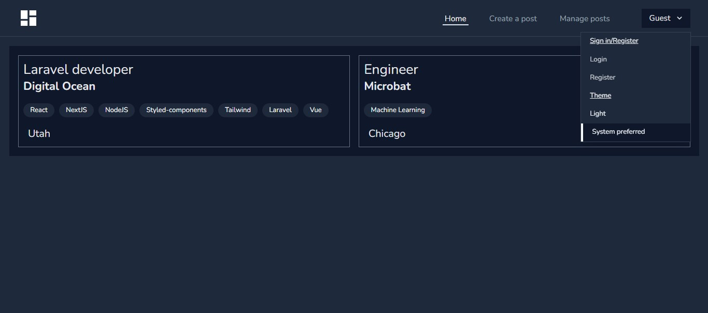
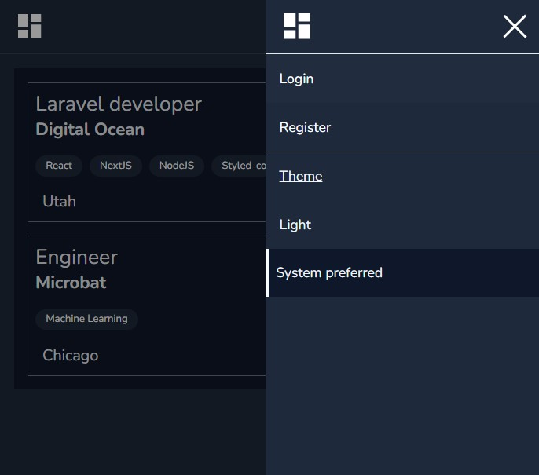

# Blog Website (Laravel 9)

## Previews

## Instructions to set up on local:

_Before moving on, make sure you have these followings installed on your pc:_ [MYSQL](https://dev.mysql.com/downloads/mysql), [Composer](https://getcomposer.org/download/), and [PHP](https://www.php.net/downloads.php)

1. Open up your terminal and enter this command: `git clone https://github.com/Abdulshakur24/laravel-poster`
2. Change the directory to the root folder by entering this command: `cd laravel-poster` and `composer install && npm install` to install all dependencies.
3. Rename the `.env.example` file to `.env`, then set the DB_PASSWORD variable to `DB_PASSWORD=your password`,
4. Enter this command `mysql -u root -p` to open up mysql shell and enter your password
5. Create the database called `laravel` by entering this SQL command: `CREATE DATABASE laravel;`, then enter `exit` command to exit the MYSQL Shell.
6. Enter this commands to `php artisan migrate` to create tables required for this project.
7. Run this command `php artisan storage:link` to create a symbolic link in the public folder.
8. Enter `php artisan key:generate` to generate your application key.
9. Then finally, run `php artisan serve` and `npm run dev` to start development server.

#### Enjoy!#
